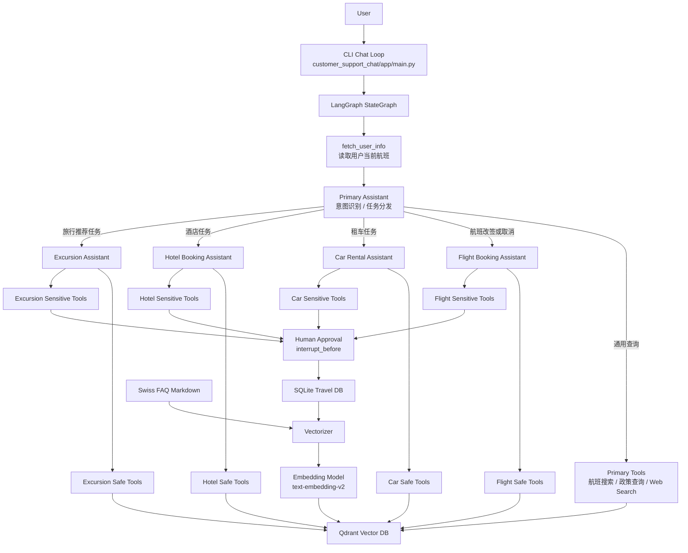
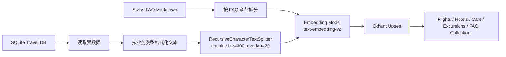

# TravelPilot

> 一个基于 LangGraph 多智能体编排、RAG 检索增强、Tool Calling 业务执行和 Human-in-the-loop 审批机制构建的智能旅行助手，支持航班查询与改签、酒店预订、租车服务、旅行推荐和航空政策问答等完整旅行服务流程。


## 1. 一句话项目描述

TravelPilot 是一个面向旅行服务场景的多 Agent RAG 应用：它以 LangGraph 状态图为核心编排主助手与多个专业助手，通过意图识别、条件路由、工具调用和敏感操作审批，将自然语言对话转化为可执行的航班、酒店、租车、旅行推荐与航空政策问答流程。

## 2. 项目亮点 / 技术要点

### 多智能体任务协作

项目不是单一聊天机器人，而是采用“主助手 + 专业助手”的多 Agent 架构。主助手负责理解用户意图、检索通用信息和分发任务；航班、酒店、租车、旅行推荐等专业助手分别处理各自领域的查询和业务操作。这样的设计让不同业务逻辑相互隔离，后续新增保险、签证、行李托运等助手时，只需要扩展新的节点、工具和路由规则。

### LangGraph 状态图编排

系统使用 LangGraph 的 `StateGraph` 构建对话流程，把每个助手、工具节点和入口节点都建模为图节点。对话不是简单的链式调用，而是根据当前消息、工具调用结果和业务状态进行条件路由。图中使用 `conditional_edges` 判断下一步进入主助手、专业助手、工具节点还是结束流程，并通过 `MemorySaver` 保存会话状态。

### RAG 检索增强

项目将旅行数据库和航空 FAQ 文档向量化后写入 Qdrant。用户提出自然语言问题时，系统会将查询转成 embedding，在对应 collection 中执行相似度搜索，再把检索结果作为工具返回值交给 Agent 推理。RAG 覆盖航班、酒店、租车、旅行推荐和政策 FAQ，避免模型只依赖自身参数回答。

### 工具调用闭环

Agent 不只负责回答问题，还可以通过 LangChain tool 调用真实业务函数。查询类工具读取 Qdrant 或 SQLite，写操作工具会更新 SQLite 中的预订状态，例如改签机票、取消机票、预订酒店、更新租车日期、取消短途游等。这样形成了“自然语言理解 -> 工具调用 -> 业务状态变更 -> 对话反馈”的闭环。

### Safe / Sensitive 工具分层

项目将工具划分为两类：

- `safe tools`：只读查询类操作，例如搜索航班、查询酒店、检索政策。
- `sensitive tools`：会改变业务状态的操作，例如改签、取消、预订、更新订单。

LangGraph 在执行 sensitive tools 前会触发 interrupt，要求用户确认后才继续执行。这是面向真实业务系统时非常关键的 human-in-the-loop 设计。

### 模块化向量化服务

向量化逻辑独立放在 `vectorizer` 模块中，负责读取 SQLite / FAQ 数据、格式化文本、切块、批量生成 embedding，并写入 Qdrant。该模块可以独立运行，也方便后续接入 Airflow、定时任务、CI/CD 或云端批处理服务。

### 可观测性支持

项目预留了 LangSmith tracing 配置，可以追踪一次请求中的 Agent 路由、LLM 调用、工具调用、RAG 检索结果和错误信息，便于调试复杂多 Agent 工作流。

## 3. 系统架构

TravelPilot 由两个核心服务组成：

- `customer_support_chat`：对话服务，负责用户输入、LangGraph 工作流、Agent 调度和工具调用。
- `vectorizer`：向量化服务，负责构建 Qdrant 向量索引。

整体架构如下：



### 主助手：Primary Assistant

主助手是整个系统的入口。它的职责不是处理所有业务，而是：

- 识别用户意图。
- 回答通用航班和政策问题。
- 在必要时调用 DuckDuckGo Web Search。
- 根据任务类型把对话转交给专业助手。
- 保持用户无感知的助手切换，不向用户暴露内部 Agent 结构。

主助手绑定了多类工具，包括 `search_flights`、`lookup_policy`、`DuckDuckGoSearchResults`，以及用于转交任务的 Pydantic 工具：`ToFlightBookingAssistant`、`ToBookCarRental`、`ToHotelBookingAssistant`、`ToBookExcursion`。

### 专业助手：Specialized Assistants

系统包含四个专业助手：

- `Flight Booking Assistant`：负责航班查询、改签、取消。
- `Car Rental Assistant`：负责租车查询、预订、更新、取消。
- `Hotel Booking Assistant`：负责酒店查询、预订、入住日期更新、取消。
- `Excursion Assistant`：负责旅行推荐查询、活动预订、更新、取消。

每个专业助手都有独立 prompt、独立工具集合和独立路由逻辑。专业助手完成任务后，可以通过 `CompleteOrEscalate` 将控制权交还给主助手。

### 意图识别与路由逻辑

主助手通过 LLM 的 tool calling 能力完成意图识别。当模型判断用户需要执行某类专业任务时，会调用对应的任务转交工具。LangGraph 的 `route_primary_assistant` 会读取最近一次 tool call 的名称，并将状态图路由到对应专业助手入口节点。

例如：

- 用户说“我想取消机票” -> 主助手调用 `ToFlightBookingAssistant` -> 进入航班助手。
- 用户说“帮我订一辆车” -> 主助手调用 `ToBookCarRental` -> 进入租车助手。
- 用户说“帮我找苏黎世酒店” -> 主助手调用 `ToHotelBookingAssistant` -> 进入酒店助手。
- 用户说“推荐当地活动” -> 主助手调用 `ToBookExcursion` -> 进入旅行推荐助手。

### 工具节点与审批机制

每个专业助手都有两类 ToolNode：

- safe tool node：执行查询类工具，完成后回到对应专业助手继续推理。
- sensitive tool node：执行写操作前触发 interrupt，等待用户确认。

当用户批准后，系统继续执行工具；如果用户拒绝，系统会把拒绝原因封装为 `ToolMessage` 返回给 Agent，让 Agent 根据用户反馈调整方案。

## 4. 功能说明

### 航班服务

- 获取当前用户已预订航班。
- 根据自然语言搜索航班。
- 查询航班号、起降机场、计划起降时间、实际起降时间和航班状态。
- 将用户机票改签到新航班。
- 取消用户机票。
- 在执行改签和取消前进行用户确认。

### 酒店服务

- 根据目的地、日期、价格偏好等自然语言条件搜索酒店。
- 查询酒店名称、位置、价格档位、入住日期、离店日期和预订状态。
- 预订酒店。
- 修改酒店入住和离店日期。
- 取消酒店预订。

### 租车服务

- 根据地点、日期、价格偏好搜索租车服务。
- 查询租车公司、地点、价格档位、租期和预订状态。
- 预订租车服务。
- 修改租车起止日期。
- 取消租车订单。

### 旅行推荐服务

- 根据目的地和偏好搜索短途游或本地活动。
- 查询活动名称、地点、关键词、详细介绍和预订状态。
- 预订旅行活动。
- 更新活动信息。
- 取消活动预订。

### 航空政策问答

- 检索 Swiss Airlines FAQ。
- 回答退改签、行李、票务等政策相关问题。
- 在执行可能涉及规则约束的写操作前，为 Agent 提供政策依据。

### 对话式审批

当 Agent 准备执行改签、取消、预订、更新等敏感操作时，系统会暂停并提示：

```text
Do you approve of the above actions? Type 'y' to continue; otherwise, explain your requested changes.
```

用户输入 `y` 后继续执行；输入其他内容时，系统会把用户反馈交还给 Agent 重新规划。

## 5. 技术栈

| 类别 | 技术 | 作用 |
| --- | --- | --- |
| 编程语言 | Python 3.12 | 项目主要开发语言 |
| 依赖管理 | Poetry | Python 依赖和虚拟环境管理 |
| 多 Agent 编排 | LangGraph | 构建状态图、条件路由、interrupt 和会话状态 |
| LLM 应用框架 | LangChain | Prompt、Tool、Runnable 和工具调用封装 |
| 对话模型 | OpenAI-compatible chat model（默认 `qwen-plus`） | 主助手和专业助手的推理模型 |
| Embedding 模型 | `text-embedding-v2` | 将旅行数据和查询文本转成向量 |
| 向量数据库 | Qdrant | 存储和检索航班、酒店、租车、FAQ 等向量数据 |
| 业务数据库 | SQLite | 保存旅行 benchmark 数据和订单状态 |
| Web Search | DuckDuckGo Search | 为主助手提供外部搜索能力 |
| 数据处理 | Pandas | SQLite 数据读取、日期平移和数据处理 |
| 异步请求 | aiohttp / asyncio | 批量调用 OpenAI Embedding API |
| 批处理辅助 | tqdm / more-itertools | embedding 进度展示和批量写入 |
| 容器化 | Docker / Docker Compose | 本地运行 Qdrant 和应用服务 |
| 可观测性 | LangSmith | 追踪 Agent、LLM、Tool 和 RAG 调用链路 |

## 6. 项目目录结构

```text
.
├── customer_support_chat/
│   ├── app/
│   │   ├── core/
│   │   │   ├── settings.py
│   │   │   ├── state.py
│   │   │   └── logger.py
│   │   ├── services/
│   │   │   ├── assistants/
│   │   │   │   ├── primary_assistant.py
│   │   │   │   ├── flight_booking_assistant.py
│   │   │   │   ├── car_rental_assistant.py
│   │   │   │   ├── hotel_booking_assistant.py
│   │   │   │   ├── excursion_assistant.py
│   │   │   │   └── assistant_base.py
│   │   │   ├── tools/
│   │   │   │   ├── flights.py
│   │   │   │   ├── cars.py
│   │   │   │   ├── hotels.py
│   │   │   │   ├── excursions.py
│   │   │   │   └── lookup.py
│   │   │   └── utils.py
│   │   ├── graph.py
│   │   └── main.py
│   ├── data/
│   └── README.md
├── vectorizer/
│   ├── app/
│   │   ├── embeddings/
│   │   │   └── embedding_generator.py
│   │   ├── vectordb/
│   │   │   ├── vectordb.py
│   │   │   ├── chunkenizer.py
│   │   │   └── utils.py
│   │   ├── core/
│   │   └── main.py
│   └── README.md
├── graphs/
│   └── multi-agent-rag-system-graph.png
├── images/
│   ├── travel_db_schema.png
│   ├── qdrant_schema.png
│   ├── langsmith.gif
│   └── multi_agent_rag_system_architecture_aws.png
├── docker-compose.yml
├── Dockerfile
├── pyproject.toml
├── poetry.lock
└── README.md
```

目录说明：

- `customer_support_chat`：对话主服务，包含 LangGraph 工作流、Agent prompt、工具函数和 CLI 入口。
- `vectorizer`：向量化服务，负责构建 Qdrant collection。
- `graphs`：存放 LangGraph 可视化结果。
- `images`：存放数据库结构、Qdrant schema、LangSmith 和部署架构图。
- `docker-compose.yml`：本地启动 Qdrant 和应用服务。

## 7. 快速开始

### 7.1 环境要求

- Python 3.12+
- Poetry
- Docker / Docker Compose
- OpenAI API Key
- LangSmith API Key，可选

### 7.2 克隆项目

```bash
git clone https://github.com/Oran9el/TravelPilot.git
cd TravelPilot
```

### 7.3 配置环境变量

```bash
cp .dev.env .env
```

编辑 `.env`：

```env
OPENAI_API_KEY="your_openai_api_key"
OPENAI_BASE_URL=https://dashscope.aliyuncs.com/compatible-mode/v1
OPENAI_CHAT_MODEL=qwen-plus
OPENAI_EMBEDDING_MODEL=text-embedding-v2
EMBEDDING_DIMENSION=1536

QDRANT_URL=http://localhost:6333
SQLITE_DB_PATH=./customer_support_chat/data/travel2.sqlite

LANGCHAIN_TRACING_V2=true
LANGCHAIN_ENDPOINT=https://api.smith.langchain.com
LANGCHAIN_API_KEY="your_langsmith_api_key"
LANGCHAIN_PROJECT="travelpilot"
```

如果暂时不使用 LangSmith，可以不填写 `LANGCHAIN_API_KEY` 和 `LANGCHAIN_PROJECT`。

### 7.4 安装依赖

```bash
poetry install
```

### 7.5 启动 Qdrant

```bash
docker compose up qdrant -d
```

Qdrant Dashboard 默认地址：

```text
http://localhost:6333/dashboard
```

### 7.6 准备 SQLite 旅行数据库

聊天服务首次启动时会自动下载 LangGraph Travel DB Benchmark 数据库。也可以先手动执行下面的命令准备数据库：

```bash
poetry run python -c "from customer_support_chat.app.services.utils import download_and_prepare_db; download_and_prepare_db()"
```

该步骤会下载 `travel2.sqlite`，并将示例航班时间平移到当前时间附近，方便本地演示。

### 7.7 生成向量索引

```bash
poetry run python -m vectorizer.app.main
```

该命令会创建并写入以下 Qdrant collections：

- `car_rentals_collection`
- `excursions_collection`
- `flights_collection`
- `hotels_collection`
- `faq_collection`

### 7.8 启动 TravelPilot

```bash
poetry run python -m customer_support_chat.app.main
```

启动后在终端中输入自然语言问题即可开始对话。输入 `q`、`quit` 或 `exit` 可退出。

## 8. 使用示例

### 查询当前航班

```text
User: What flights do I currently have booked?
```

系统会根据配置中的 `passenger_id` 读取当前用户机票，并返回航班号、起降机场、时间、座位和舱位信息。

### 查询航班政策

```text
User: What is the policy for changing my flight?
```

主助手会调用 FAQ 检索工具，从 `faq_collection` 中查询相关政策并生成回答。

### 改签航班

```text
User: I want to change my flight to another flight tomorrow.
```

可能的流程：

```text
Primary Assistant -> Flight Booking Assistant -> search_flights -> update_ticket_to_new_flight -> User Approval -> SQLite Update
```

系统在真正执行改签前会要求用户确认。

### 预订酒店

```text
User: I need a hotel in Zurich from May 10 to May 12.
```

系统会转交给酒店助手，先检索酒店候选项，再根据用户确认执行预订。

### 租车

```text
User: Help me rent a car in Basel for three days.
```

系统会进入租车助手，检索合适车辆并在预订前触发确认。

### 旅行推荐

```text
User: Recommend some activities in Geneva.
```

系统会从旅行推荐 collection 中检索相关活动，并可以继续完成活动预订。

## 9. RAG 数据流程

TravelPilot 的 RAG 链路分为离线索引和在线检索两个阶段。

### 9.1 离线索引阶段

数据来源包括：

- LangGraph Travel DB Benchmark 中的 SQLite 旅行数据库。
- Swiss Airlines FAQ Markdown 文档。

处理流程：



SQLite 中不同表会被格式化成适合语义检索的文本：

- 航班：航班号、起降机场、计划时间、实际时间、状态、机型。
- 酒店：酒店名称、位置、价格档位、入住日期、离店日期、预订状态。
- 租车：租车公司、位置、价格档位、租期、预订状态。
- 短途游：活动名称、地点、详情、关键词、预订状态。
- FAQ：保留政策问答内容，用于航空政策检索。

随后系统使用 `text-embedding-v2` 生成 1536 维向量，并写入 Qdrant。Qdrant collection 使用 cosine distance 做相似度搜索。

### 9.2 在线检索阶段

当用户提出问题时：

1. Agent 判断是否需要调用检索工具。
2. 检索工具将用户 query 转为 embedding。
3. 系统在对应 Qdrant collection 中执行相似度搜索。
4. 工具返回结构化 payload，包括业务字段、原始 chunk 和 similarity score。
5. Agent 基于检索结果生成回答，或继续调用写操作工具。

例如用户问“帮我找苏黎世的酒店”，酒店助手会调用 `search_hotels`，该工具会查询 `hotels_collection`，并返回最相关的酒店候选项。

### 9.3 向量数据库设计

当前项目使用的 collection：

| Collection | 数据来源 | 用途 |
| --- | --- | --- |
| `flights_collection` | `flights` 表 | 航班语义检索 |
| `hotels_collection` | `hotels` 表 | 酒店语义检索 |
| `car_rentals_collection` | `car_rentals` 表 | 租车语义检索 |
| `excursions_collection` | `trip_recommendations` 表 | 旅行活动推荐检索 |
| `faq_collection` | Swiss Airlines FAQ | 航空政策问答 |


## 10. 多 Agent 工作流

TravelPilot 的多 Agent 工作流可以拆成以下步骤：

### 10.1 初始化用户上下文

每次会话启动时，系统会生成唯一 `thread_id`，并配置当前 `passenger_id`。LangGraph 首先执行 `fetch_user_info` 节点，从 SQLite 中读取用户当前航班，并把结果写入 graph state。

State 主要包含：

- `messages`：对话历史。
- `user_info`：当前用户航班信息。
- `dialog_state`：当前对话所处的助手栈。

### 10.2 主助手理解意图

主助手收到用户输入后，结合当前用户航班信息和对话历史进行判断：

- 如果是普通问题，直接回答或调用查询工具。
- 如果是政策问题，调用 `lookup_policy`。
- 如果是航班改签/取消，转交航班助手。
- 如果是租车、酒店、旅行推荐任务，转交对应专业助手。

### 10.3 进入专业助手

进入专业助手前，系统会插入一个 entry node。该节点会生成一条 `ToolMessage`，告诉专业助手当前任务上下文，并更新 `dialog_state`。

专业助手只关注自己的领域，避免所有业务逻辑都挤在一个 prompt 里。

### 10.4 执行工具调用

专业助手根据任务选择工具：

- 查询阶段调用 safe tools。
- 变更阶段调用 sensitive tools。

工具执行失败时，`create_tool_node_with_fallback` 会捕获异常，并把错误信息返回给 Agent，让 Agent 重新修正调用参数或调整回答。

### 10.5 敏感操作确认

如果下一步是 sensitive tool，LangGraph 会在执行前暂停。用户可以：

- 输入 `y`：批准执行工具。
- 输入其他内容：拒绝或修改要求，系统将反馈交还给 Agent。

### 10.6 完成或升级任务

专业助手完成当前任务后，可以调用 `CompleteOrEscalate`：

- 如果任务已完成，交还主助手。
- 如果用户改变需求，交还主助手重新判断。
- 如果当前助手没有合适工具，也交还主助手处理。

## 11. 本地开发说明

### 重新生成图结构

运行聊天服务时，项目会尝试生成 LangGraph 图结构图片：

```bash
poetry run python -m customer_support_chat.app.main
```

生成结果保存在：

```text
graphs/multi-agent-rag-system-graph.png
```

### 重新构建向量库

当 SQLite 数据或 FAQ 内容变化后，重新运行：

```bash
poetry run python -m vectorizer.app.main
```

`VectorDB` 在 `create_collection=True` 时会删除并重建对应 collection。

### 修改默认用户

CLI 中默认 passenger id 配置在 `customer_support_chat/app/main.py`：

```python
"passenger_id": "5102 899977"
```

你可以替换成 SQLite 数据库中存在的其他 passenger id。

### 添加新的专业助手

推荐步骤：

1. 在 `customer_support_chat/app/services/tools/` 中新增业务工具。
2. 在 `customer_support_chat/app/services/assistants/` 中新增专业助手 prompt 和 tool binding。
3. 在 `customer_support_chat/app/graph.py` 中新增 entry node、assistant node、safe tool node、sensitive tool node。
4. 在主助手中新增 Pydantic 任务转交工具。
5. 在 `route_primary_assistant` 中加入新的路由分支。

### 添加新的 RAG 数据源

推荐步骤：

1. 在 SQLite 或外部数据源中准备结构化数据。
2. 在 `vectorizer/app/vectordb/vectordb.py` 中新增格式化逻辑。
3. 在 `vectorizer/app/main.py` 中加入新的 table / collection。
4. 新增 search tool，并绑定到对应助手。

### 清理 Python 缓存

```bash
make clean
```

## 12. 可观测性

项目支持通过 LangSmith 观察多 Agent 调用链路。启用方式是在 `.env` 中配置：

```env
LANGCHAIN_TRACING_V2=true
LANGCHAIN_ENDPOINT=https://api.smith.langchain.com
LANGCHAIN_API_KEY="your_langsmith_api_key"
LANGCHAIN_PROJECT="travelpilot"
```

启用后可以观察：

- 每次用户请求经过了哪些 Agent。
- LLM 生成了哪些 tool calls。
- 工具调用参数和返回值。
- RAG 检索命中的 chunk 和 similarity。
- sensitive tools 是否触发 interrupt。
- 异常发生在哪个节点。


## 13. 部署建议

当前项目适合本地 CLI 演示和架构学习。如果要扩展为生产级系统，可以按以下方向演进。

### 应用服务层

- 使用 FastAPI 封装聊天接口。
- 使用 WebSocket 或 SSE 支持流式输出。
- 增加前端页面，例如 React / Next.js。
- 将 CLI 中的 `thread_id`、`passenger_id` 改为真实用户会话。

### 数据层

- 将 SQLite 替换为 PostgreSQL 或 MySQL。
- 使用 Redis 保存短期会话状态。
- 将 Qdrant 部署为独立服务或托管向量数据库。
- 为写操作增加事务、幂等性、审计日志和权限校验。

### 向量化管道

- 使用 Airflow、Prefect 或云端定时任务调度 embedding job。
- 将新数据增量写入 Qdrant，而不是每次全量重建。
- 为不同业务数据设计更细粒度的 metadata filter。

### 模型与提示词

- 根据成本和延迟选择不同 OpenAI 模型。
- 为每个专业助手加入更严格的 tool-use policy。
- 增加检索结果 grounding 检查，降低幻觉风险。

### 云部署参考

可以参考下图将系统拆分为数据层、向量化任务、聊天服务、监控和 CI/CD：


推荐部署组合：

- API Gateway / Load Balancer：统一入口。
- EKS / ECS：运行聊天服务和向量化任务。
- RDS：存储业务数据。
- Qdrant：向量检索服务。
- Redis / ElastiCache：会话缓存。
- S3：存储原始数据和处理后的文档。
- CloudWatch / Grafana / LangSmith：监控和可观测性。
- Secrets Manager：管理 OpenAI、LangSmith、数据库等密钥。

## 14. License / 致谢

### License

本项目采用 MIT License，详见仓库中的 `LICENSE` 文件。

### 致谢

本项目使用或参考了以下开源生态和数据资源：

- [LangGraph](https://github.com/langchain-ai/langgraph)：多 Agent 状态图和工作流编排。
- [LangChain](https://github.com/langchain-ai/langchain)：LLM 应用开发、Prompt 和 Tool 抽象。
- [Qdrant](https://github.com/qdrant/qdrant)：向量数据库。
- [OpenAI](https://platform.openai.com/)：对话模型和 embedding 模型。
- [LangSmith](https://www.langchain.com/langsmith)：LLM 应用观测与调试。
- [LangGraph Travel DB Benchmark](https://storage.googleapis.com/benchmarks-artifacts/travel-db)：旅行数据库和 Swiss Airlines FAQ 数据来源。

TravelPilot 的目标是展示一个可运行、可扩展、可解释的多 Agent RAG 旅行助手架构，为更复杂的智能客服、旅行规划和企业流程自动化系统提供参考实现。
