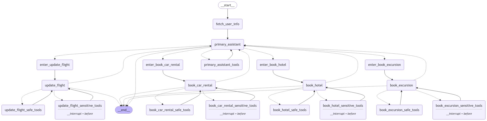
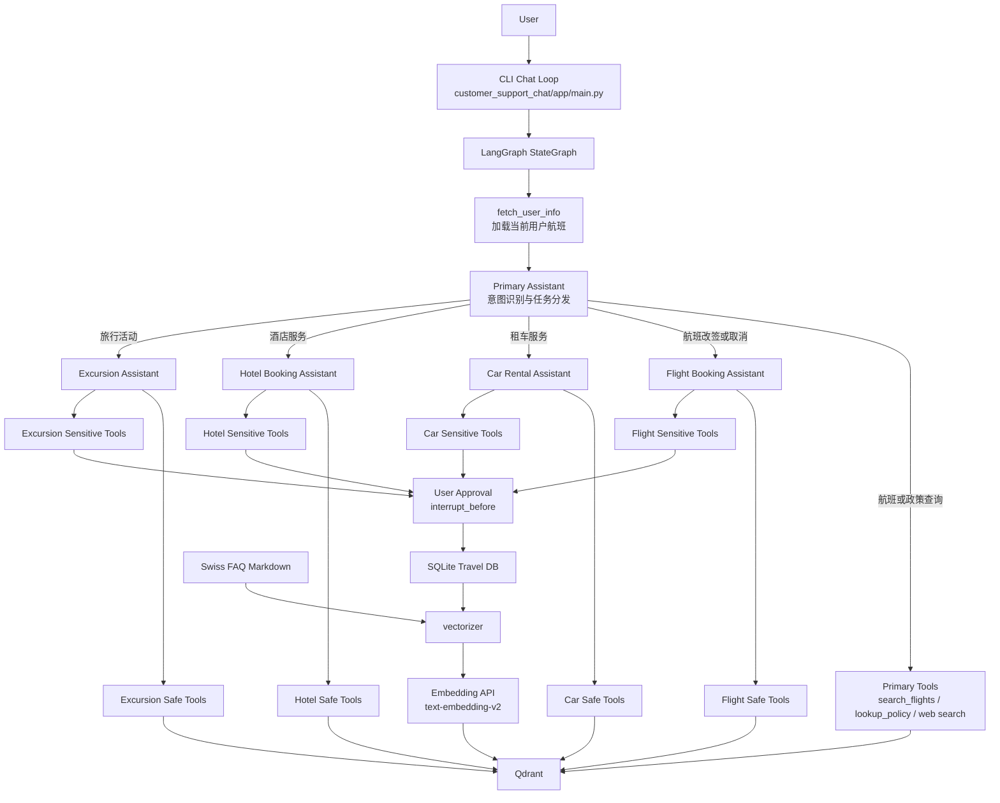
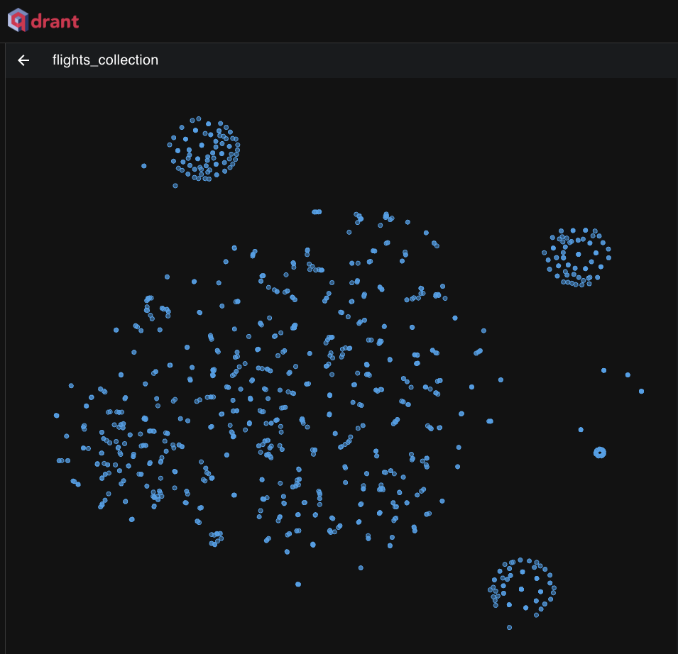
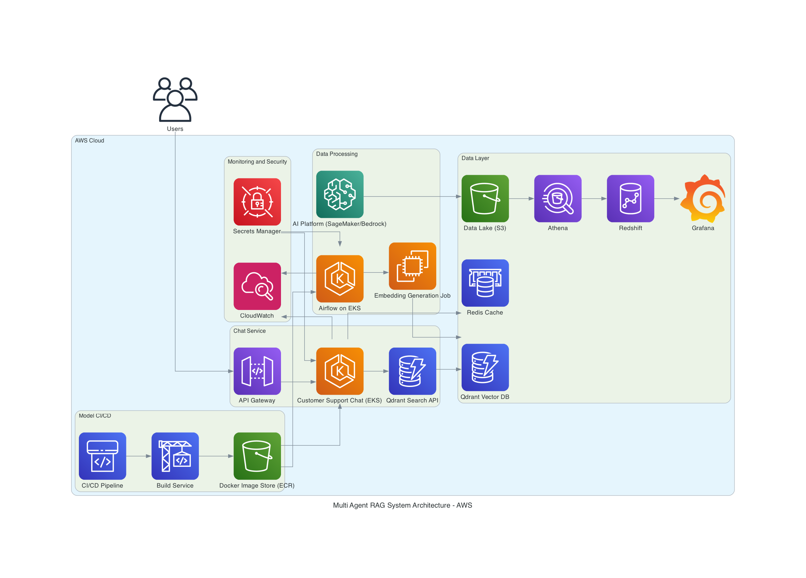

# TravelPilot

TravelPilot 是一个面向旅行服务场景的多 Agent RAG 助手项目。它使用 LangGraph 编排主助手和多个专业助手，通过 Qdrant 向量检索、LangChain Tool Calling、SQLite 业务数据更新和人工审批机制，把自然语言请求转化为可查询、可确认、可执行的旅行服务流程。

项目当前提供命令行交互入口，适合用于展示多智能体任务路由、检索增强生成、工具调用闭环和敏感操作 human-in-the-loop 设计。



## 项目定位

TravelPilot 不是一个简单的问答机器人，而是一个“对话入口 + 业务工具 + 数据检索 + 状态变更”的旅行助手原型。用户可以用自然语言查询航班、了解航空政策、搜索酒店或租车服务，也可以在确认后执行改签、取消、预订和更新等会改变数据库状态的操作。

这个项目重点展示以下能力：

- 使用 LangGraph `StateGraph` 管理多 Agent 工作流，而不是把所有业务逻辑塞进一个 Prompt。
- 使用主助手识别意图，并把航班、酒店、租车、旅行推荐任务交给对应专业助手处理。
- 使用 Qdrant 保存航班、酒店、租车、旅行推荐和 FAQ 的向量索引，为 Agent 提供可检索上下文。
- 使用 LangChain tools 封装真实业务函数，让 Agent 可以读取或更新 SQLite 中的旅行数据。
- 使用 `interrupt_before` 在敏感工具执行前暂停，让用户确认后再继续。
- 使用 LangSmith tracing 观察 Agent 路由、LLM 调用、工具调用和检索链路。

## 功能概览

| 能力 | 当前实现 | 关键文件 |
| --- | --- | --- |
| 用户航班查询 | 根据 `passenger_id` 读取当前用户已订机票 | `customer_support_chat/app/services/tools/flights.py` |
| 航班语义搜索 | 基于 Qdrant `flights_collection` 检索航班 | `customer_support_chat/app/services/tools/flights.py` |
| 航班改签/取消 | 更新或删除 SQLite 中的票务记录，执行前需要用户确认 | `customer_support_chat/app/services/tools/flights.py` |
| 酒店查询与预订 | 检索酒店候选项，支持预订、改日期、取消 | `customer_support_chat/app/services/tools/hotels.py` |
| 租车查询与预订 | 检索租车服务，支持预订、改日期、取消 | `customer_support_chat/app/services/tools/cars.py` |
| 旅行推荐 | 检索本地活动或短途游，支持预订、更新、取消 | `customer_support_chat/app/services/tools/excursions.py` |
| 航空政策问答 | 检索 Swiss Airlines FAQ，为回答或改签决策提供依据 | `customer_support_chat/app/services/tools/lookup.py` |
| 向量索引构建 | 从 SQLite 和 FAQ 文档生成 embedding 后写入 Qdrant | `vectorizer/app/main.py` |
| 对话审批 | sensitive tools 执行前触发 interrupt，由用户批准或反馈 | `customer_support_chat/app/main.py` |

## 系统架构

项目由两条主链路组成：

- 离线索引链路：`vectorizer` 读取旅行数据库和 FAQ 文档，格式化成适合语义检索的文本，生成 embedding 并写入 Qdrant。
- 在线对话链路：`customer_support_chat` 接收用户输入，使用 LangGraph 调度主助手、专业助手和工具节点，必要时暂停等待用户确认。



## Agent 设计

### Primary Assistant

主助手是用户唯一能直接感知到的对话入口。它负责理解用户意图、回答通用问题、检索航班和政策信息，并在任务属于具体业务域时调用对应的任务转交工具。

主助手绑定的主要工具包括：

- `search_flights`
- `lookup_policy`
- `DuckDuckGoSearchResults`
- `ToFlightBookingAssistant`
- `ToBookCarRental`
- `ToHotelBookingAssistant`
- `ToBookExcursion`

### Specialized Assistants

专业助手各自拥有独立 Prompt、safe tools 和 sensitive tools。

| Assistant | Safe tools | Sensitive tools |
| --- | --- | --- |
| Flight Booking Assistant | `search_flights` | `update_ticket_to_new_flight`, `cancel_ticket` |
| Car Rental Assistant | `search_car_rentals` | `book_car_rental`, `update_car_rental`, `cancel_car_rental` |
| Hotel Booking Assistant | `search_hotels` | `book_hotel`, `update_hotel`, `cancel_hotel` |
| Excursion Assistant | `search_trip_recommendations` | `book_excursion`, `update_excursion`, `cancel_excursion` |

如果专业助手发现当前任务已经完成、用户改变主意，或自己的工具无法处理新的需求，它会通过 `CompleteOrEscalate` 把控制权交还给主助手。

## RAG 数据流

TravelPilot 的 RAG 不是只针对 FAQ 的单一知识库，而是覆盖了旅行业务中的多个结构化表。

### 离线索引

1. `customer_support_chat.app.services.utils.download_and_prepare_db()` 下载 LangGraph Travel DB Benchmark 的 SQLite 数据库。
2. `update_dates()` 将示例航班时间平移到当前时间附近，方便本地演示。
3. `vectorizer.app.main.create_collections()` 依次处理航班、酒店、租车、旅行推荐和 FAQ。
4. `VectorDB.format_content()` 将结构化记录转换为自然语言片段。
5. `RecursiveCharacterTextSplitter` 对文本切块。
6. OpenAI-compatible embedding API 生成向量。
7. Qdrant 使用 cosine distance 保存并检索向量。

当前创建的 collections：

| Collection | 数据来源 | 作用 |
| --- | --- | --- |
| `flights_collection` | `flights` 表 | 航班检索 |
| `hotels_collection` | `hotels` 表 | 酒店检索 |
| `car_rentals_collection` | `car_rentals` 表 | 租车检索 |
| `excursions_collection` | `trip_recommendations` 表 | 旅行活动检索 |
| `faq_collection` | Swiss Airlines FAQ | 航空政策问答 |



### 在线检索

用户提出问题后，Agent 会判断是否需要调用检索工具。检索工具把 query 转为 embedding，在对应 collection 中取回相似记录，并把 payload、原始文本 chunk 和 similarity score 返回给 Agent。Agent 再基于这些结果回答问题或继续调用写操作工具。

## 技术栈

| 类别 | 技术 |
| --- | --- |
| 语言 | Python 3.12 |
| 依赖管理 | Poetry |
| 多 Agent 编排 | LangGraph |
| LLM 应用框架 | LangChain |
| 对话模型 | OpenAI-compatible chat model，默认 `qwen-plus` |
| Embedding 模型 | `text-embedding-v2` |
| 向量数据库 | Qdrant |
| 业务数据库 | SQLite |
| 外部搜索 | DuckDuckGo Search |
| 数据处理 | Pandas |
| 异步请求 | aiohttp / asyncio |
| 可观测性 | LangSmith |
| 本地服务 | Docker / Docker Compose |

## 项目结构

```text
.
├── customer_support_chat/
│   ├── app/
│   │   ├── core/
│   │   │   ├── logger.py
│   │   │   ├── settings.py
│   │   │   └── state.py
│   │   ├── services/
│   │   │   ├── assistants/
│   │   │   ├── tools/
│   │   │   ├── vectordb/
│   │   │   └── utils.py
│   │   ├── graph.py
│   │   └── main.py
│   ├── data/
│   └── README.md
├── vectorizer/
│   ├── app/
│   │   ├── core/
│   │   ├── embeddings/
│   │   ├── vectordb/
│   │   └── main.py
│   └── README.md
├── graphs/
├── images/
├── docker-compose.yml
├── Dockerfile
├── pyproject.toml
├── poetry.lock
└── README.md
```

目录职责：

- `customer_support_chat`：CLI 对话入口、LangGraph 状态图、Agent Prompt、工具函数和 SQLite 操作。
- `vectorizer`：离线向量化任务，负责构建 Qdrant collection。
- `graphs`：保存 LangGraph 结构图。
- `images`：保存数据库结构、Qdrant schema、LangSmith 和部署参考图。

## 快速开始

### 1. 克隆项目

```bash
git clone https://github.com/Oran9el/TravelPilot.git
cd TravelPilot
```

### 2. 准备环境

需要提前安装：

- Python 3.12+
- Poetry
- Docker / Docker Compose
- OpenAI-compatible API Key

复制环境变量模板：

```bash
cp .dev.env .env
```

按需修改 `.env`：

```env
OPENAI_API_KEY="your_api_key"
OPENAI_BASE_URL=https://dashscope.aliyuncs.com/compatible-mode/v1
OPENAI_CHAT_MODEL=qwen-plus
OPENAI_EMBEDDING_MODEL=text-embedding-v2
EMBEDDING_DIMENSION=1536

QDRANT_URL=http://localhost:6333
SQLITE_DB_PATH=./customer_support_chat/data/travel2.sqlite

LANGCHAIN_TRACING_V2=false
LANGCHAIN_ENDPOINT=https://api.smith.langchain.com
LANGCHAIN_API_KEY=""
LANGCHAIN_PROJECT=travelpilot
```

### 3. 安装依赖

```bash
poetry install
```

### 4. 启动 Qdrant

```bash
docker compose up qdrant -d
```

Qdrant Dashboard：

```text
http://localhost:6333/dashboard
```

### 5. 准备 SQLite 数据库

聊天服务首次启动时会自动下载数据库。也可以提前执行：

```bash
poetry run python -c "from customer_support_chat.app.services.utils import download_and_prepare_db; download_and_prepare_db()"
```

### 6. 构建向量索引

```bash
poetry run python -m vectorizer.app.main
```

### 7. 启动对话

```bash
poetry run python -m customer_support_chat.app.main
```

启动后在终端输入问题即可对话。输入 `q`、`quit` 或 `exit` 退出。

## 示例对话

查询当前机票：

```text
User: What flights do I currently have booked?
```

查询政策：

```text
User: What is the policy for changing my flight?
```

改签航班：

```text
User: I want to change my flight to another flight tomorrow.
```

执行改签前，系统会暂停并提示：

```text
Do you approve of the above actions? Type 'y' to continue; otherwise, explain your requested changes.
```

预订酒店：

```text
User: I need a hotel in Zurich from May 10 to May 12.
```

租车：

```text
User: Help me rent a car in Basel for three days.
```

旅行推荐：

```text
User: Recommend some activities in Geneva.
```

## 配置说明

| 变量 | 说明 | 默认值 |
| --- | --- | --- |
| `OPENAI_API_KEY` | OpenAI-compatible API Key | 空 |
| `OPENAI_BASE_URL` | OpenAI-compatible API 地址 | `https://dashscope.aliyuncs.com/compatible-mode/v1` |
| `OPENAI_CHAT_MODEL` | 对话模型 | `qwen-plus` |
| `OPENAI_EMBEDDING_MODEL` | embedding 模型 | `text-embedding-v2` |
| `EMBEDDING_DIMENSION` | 向量维度 | `1536` |
| `QDRANT_URL` | Qdrant 地址 | `http://localhost:6333` |
| `SQLITE_DB_PATH` | SQLite 数据库路径 | `./customer_support_chat/data/travel2.sqlite` |
| `LANGCHAIN_TRACING_V2` | 是否开启 LangSmith tracing | `false` |
| `LANGCHAIN_PROJECT` | LangSmith 项目名 | `travelpilot` |

## 本地开发

重新生成 LangGraph 图：

```bash
poetry run python -m customer_support_chat.app.main
```

生成结果保存在：

```text
graphs/multi-agent-rag-system-graph.png
```

重新构建 Qdrant 向量库：

```bash
poetry run python -m vectorizer.app.main
```

修改默认用户：

```python
"passenger_id": "5102 899977"
```

该配置位于 `customer_support_chat/app/main.py`，可以替换为 SQLite 数据库中存在的其他 passenger id。

清理 Python 缓存：

```bash
make clean
```

## 可扩展方向

这个项目目前是本地 CLI 原型，如果继续演进，可以从这些方向扩展：

- 使用 FastAPI 暴露 HTTP 接口。
- 使用 WebSocket 或 SSE 支持流式对话。
- 增加 React / Next.js 前端。
- 将 SQLite 替换为 PostgreSQL 或 MySQL。
- 用 Redis 保存短期会话状态。
- 为写操作增加事务、幂等性、审计日志和权限校验。
- 将向量索引任务改造成 Airflow、Prefect 或云端定时任务。
- 增加更细粒度的 metadata filter 和检索结果 grounding 检查。



## License

本项目采用 MIT License，详见 [LICENSE](./LICENSE)。

## 致谢

项目使用或参考了以下开源生态和数据资源：

- [LangGraph](https://github.com/langchain-ai/langgraph)
- [LangChain](https://github.com/langchain-ai/langchain)
- [Qdrant](https://github.com/qdrant/qdrant)
- [OpenAI](https://platform.openai.com/)
- [LangSmith](https://www.langchain.com/langsmith)
- [LangGraph Travel DB Benchmark](https://storage.googleapis.com/benchmarks-artifacts/travel-db)
